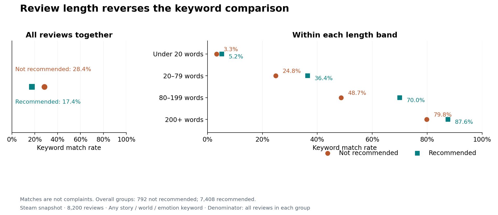

# Beyond the Thumbs-Up

[](https://github.com/VincentTLe/wukong-player-experience/actions/workflows/verify.yml)

**What can 8,200 Steam reviews tell us about Black Myth: Wukong's story and world?**

A player can enjoy a story without understanding all of it. Another can praise the storytelling and still reject the game. This project uses player reviews to find those contrasts—and turn them into questions a game research team could investigate.

**[Read the complete notebook](notebooks/wukong_player_experience.ipynb)** · [Short research brief](docs/research_brief.md) · [Methods](docs/methodology.md)

## What we found

- **A recommendation is not a story rating.** Selected reviews distinguish story enjoyment, plot comprehension, combat frustration, and immersion.
- **Review length changes the picture.** Story, world, and emotion keywords appear more often in non-recommending reviews overall. Within each of four length bands, the direction reverses. A raw keyword comparison would be misleading.
- **Specific comments lead to specific research questions.** Chapter transitions and invisible boundaries are useful places to investigate comprehension and immersion. The evidence does not establish how common these problems are.



The chart measures **keyword matches, not complaints**. A keyword can appear in praise, criticism, a template, or an unrelated use. The notebook explains the denominators and follows the numbers back to individual reviews.

## The evidence

The study covers **8,200 English-tagged Steam reviews created September 17, 2025–September 16, 2026 UTC**, collected September 17, 2026. Of these, 7,408 (90.3%) recommend the game.

The analysis combines descriptive comparisons, 24 assistant-annotated close readings, and an exploratory text model. The close readings are deliberately balanced between recommendation types; they do not estimate community opinion. The model groups vocabulary to support exploration, not to classify verified complaints.

This is an independent personal study. It is not affiliated with the game's developer or Valve.

## Read or reproduce

The notebook includes saved results, plain-English explanations, and short code cells. No account, API key, or live collection is needed to reproduce the analysis from the prepared inputs.

Use **Python 3.12**:

```bash
git clone https://github.com/VincentTLe/wukong-player-experience.git
cd wukong-player-experience
python -m venv .venv
```

Activate the environment with `.venv\Scripts\Activate.ps1` in Windows PowerShell, or `source .venv/bin/activate` on macOS/Linux. Then run:

```bash
pip install -r requirements.txt
python scripts/run_notebook.py
python -m unittest discover -s tests -v
```

The runner executes the notebook and creates an [HTML companion](reports/wukong_player_experience.html), which can be opened in a browser after downloading or cloning the repository. To repeat the optional model stability checks:

```bash
python scripts/check_model_stability.py
```

**Reproducibility boundary:** this repository includes review-level features, short attributed excerpts, and the prepared TF-IDF matrix. It supports rerunning the calculations and text model offline. It does not include full review texts or raw API responses, so it cannot independently reproduce raw-text preprocessing. See the [methodology](docs/methodology.md#what-can-be-reproduced).

## Project guide

| Location | Purpose |
|---|---|
| [Main notebook](notebooks/wukong_player_experience.ipynb) | The complete story, calculations, figures, and conclusions |
| [Research brief](docs/research_brief.md) | Findings and concrete questions for further research |
| [Methodology](docs/methodology.md) | Collection, analysis choices, model checks, and limitations |
| [Data dictionary](docs/data_dictionary.md) | What each public input represents |
| `data/` | Prepared analytical inputs, excerpts, and provenance |
| `scripts/` | Notebook execution, export, and optional model checks |
| `tests/` | Checks on data and analytical calculations |
| `reports/` | Generated figures and HTML notebook |

## AI assistance

Code, analysis, writing, and the recorded review annotations were developed with AI assistance. The annotations are assistant judgments, not independent human validation. The project author is responsible for reviewing the work and its final interpretations; publication should not be read as evidence that every label has been independently verified.

Corrections and suggestions are welcome. See [CONTRIBUTING.md](CONTRIBUTING.md), particularly the guidance on distinguishing observations from interpretations.
